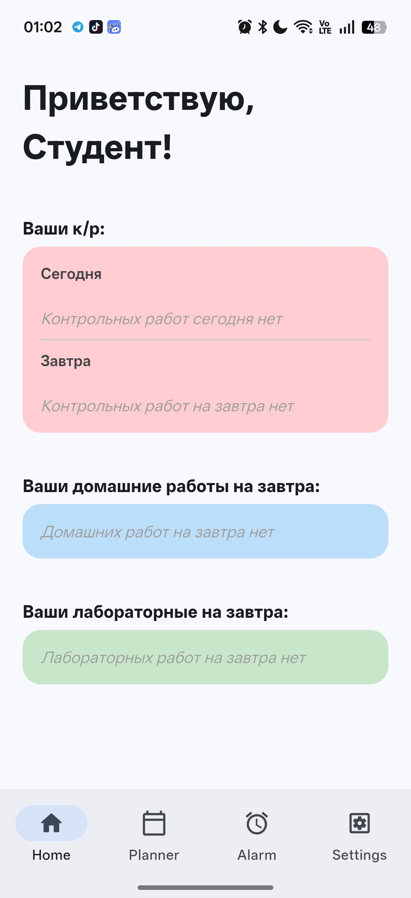
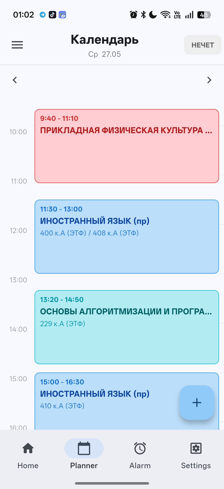
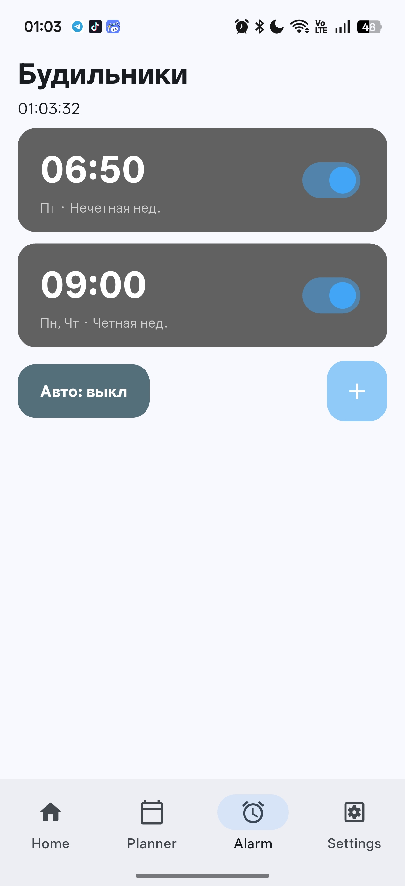
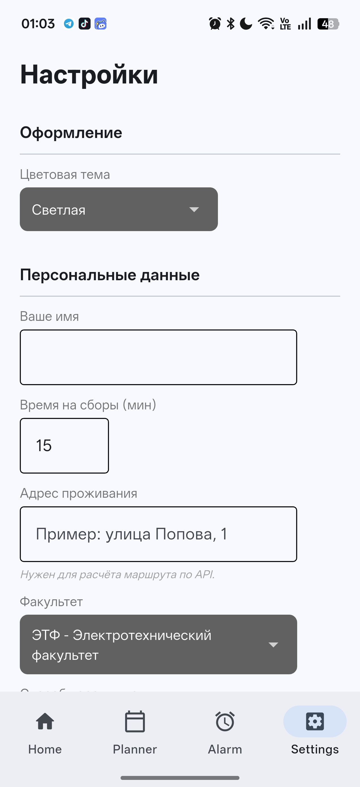

# PNIPU_Planner — Университетский помощник

Университетский помощник — приложение для студентов ПНИПУ, помогающее организовать учебный процесс.

[](https://isocpp.org)
[](https://python.org)
[](https://flet.dev)
[](https://developer.android.com)
[](https://flet.dev)

---

## 📸 Скриншоты

| Главная | Планер (день) | Будильники | Настройки |
|---------|--------------|------------|-----------|
|  |  |  |  |

## ✨ Возможности

### 📆 Расписание
- Импорт расписания из Excel-файлов ПНИПУ (через нативный C++ парсер)
- Поддержка чётных/нечётных недель
- Хранение нескольких шаблонов для разных периодов семестра

### ✅ Задачи
- Три типа: **домашняя работа**, **контрольная работа**, **лабораторная работа**
- Привязка задачи к конкретной паре
- Приоритеты: обычная → важная → срочная → критическая
- Рейтинг срочности — вычисляется с учётом приоритета и дедлайна
- Фильтрация и сортировка по дате, предмету, приоритету

### ⏰ Будильники
- Ручные будильники (разовые, по дням недели, по чётности недели)
- **Авто-будильник** — рассчитывает время пробуждения автоматически на основе ближайшей пары и маршрута

### 🗺️ Маршруты
- Геокодирование адреса через **Yandex Geocoder API**
- Расчёт времени в пути через **2ГИС Routing API**
- Поддержка: пешком, автомобиль, общественный транспорт
- Координаты всех факультетов ПНИПУ встроены в приложение

## 🛠️ Технологии

| Компонент | Технология |
|-----------|------------|
| UI-фреймворк | [Flet](https://flet.dev) 0.85.0 (Flutter под Python) |
| Язык | Python 3.11+ |
| Нативное ядро | C++11 → `libplanner_core.so` / `.dll` |
| Импорт расписания | нативный XLSX-парсер |
| API маршрутов | 2ГИС Routing API |
| API геокодирования | Yandex Geocoder API |
| API погоды | Яндекс.Погода API |
| Хранилище | JSON-файлы в `~/.pnipu_planner/` |

---

## 🗂️ Структура проекта

```
app/
├── main.py                          # Точка входа, роутинг, инициализация
│
├── bridges/
│   └── planner_bridge.py            # ctypes-обёртка над C++ ядром
│
├── managers/
│   ├── alarm_manager.py             # Хранилище и логика будильников
│   ├── auto_alarm_service.py        # Авто-будильник по расписанию
│   ├── config_manager.py            # Настройки пользователя
│   ├── notification_manager.py      # Уведомления о задачах
│   ├── planner_manager.py           # Хранилище пар и событий
│   ├── schedule_manager.py          # Шаблоны расписания
│   └── tasks_manager.py             # Хранилище задач
│
├── models/
│   ├── alarm_model.py               # Модель будильника
│   ├── lesson_model.py              # Модель пары / события
│   ├── schedule_template.py         # Шаблон расписания
│   ├── task_model.py                # Модель задачи
│   └── user_config.py               # Конфигурация пользователя
│
├── views/
│   ├── home_view.py                 # Главный экран
│   ├── planner_view.py              # Экран планера
│   ├── alarm_view.py                # Экран будильников
│   └── settings_view.py             # Экран настроек
│
├── utils/
│   ├── campus_locations.py          # Координаты факультетов ПНИПУ
│   ├── geocoder_utils.py            # Яндекс Геокодер
│   ├── route_utis.py                # 2ГИС Routing
│   ├── time_utils.py                # Вспомогательное (приветствие и т.д.)
│   └── weather_utils.py             # Яндекс.Погода
│
├── native/
│   └── jniLibs/
│       └── arm64-v8a/
│           ├── libplanner_core.so   # Нативное ядро для Android
│           └── libc++_shared.so
│
└── requirements.txt
```

---

## ⚙️ Установка и запуск

### Требования

- Python 3.11+
- Flet 0.85.0
- Скомпилированный `libplanner_core` (`.dll` для Windows, `.so` для Linux/Android)

### Установка зависимостей

```bash
cd app
pip install -r requirements.txt
```

### Запуск на ПК

```bash
cd app
python main.py
```

### Сборка APK для Android

> ⚠️ Для Android нужен Android SDK 36 и Build-Tools 28.0.3

```bash
# Из корня проекта
flet build apk --project pnipu_planner
```

Убедись, что:
- В `native/jniLibs/arm64-v8a/` лежат `libplanner_core.so` и `libc++_shared.so`
- `requirements.txt` не содержит dev-зависимостей (dev-пакеты ломают сборку)

---

## 📱 Хранилище данных

Все данные хранятся локально:

| Файл | Содержимое |
|------|------------|
| `~/.pnipu_planner/config.json` | Настройки пользователя |
| `~/.pnipu_planner/schedule.json` | Шаблоны расписания |
| `~/.pnipu_planner/custom_events.json` | Пользовательские пары и события |
| `~/.pnipu_planner/tasks.json` | Все задачи |
| `~/.pnipu_planner/alarms.json` | Будильники |

На Android путь: `/data/user/0/<package>/files/.pnipu_planner/`

---
## ⚠️ Известные ограничения

- `ft.FilePicker` нестабилен на десктопе — используется `tkinter.filedialog` как замена на Windows.
- Нативное ядро (`libplanner_core`) должно быть скомпилирован отдельно.

---

## 🔌 Нативное ядро (C++)

Вся критичная логика вынесена в `libplanner_core` (C++11, без внешних зависимостей):

- Расчёт рейтинга и срочности задач
- Фильтрация и сортировка
- Работа с чётностью недель
- Логика срабатывания будильников
- Парсинг Excel-расписания

Интерфейс — `ctypes` через `app/bridges/planner_bridge.py`.

---

## ⚙️ Конфигурация

Приложение хранит настройки в менеджере конфигурации (`.pnipu_planner/config.json`):
- Имя пользователя
- Тема оформления (light/dark/system)
- Факультет обучающегося
- Адрес проживания

Расписание занятий загружается из `.pnipu_planner/schedule.json` и автоматически применяется на указанный семестр. Также все записи студента (контрольные, домашние, лабораторные работы) хранятся в той же директории в файле `tasks.json`.

Все будильники настроенные пользователем хранятся в конфиге `.pnipu_planner/alarms.json`.

## 📄 Лицензия

Проект распространяется под лицензией, указанной в файле [LICENSE](LICENSE).

---

*Сделано для студентов ПНИПУ 🎓*
